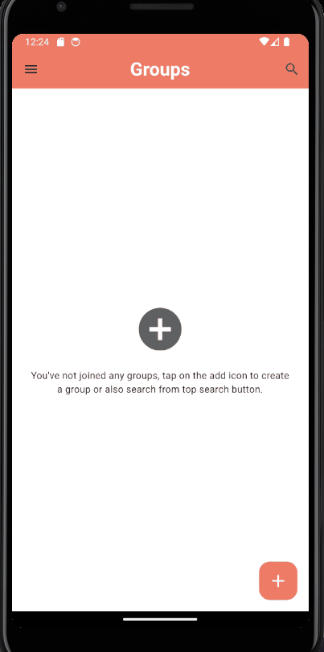

# LineChatRoom
## 描述
這是一個利用 Flutter 和 Firebase 建立的聊天室。

## 功能介紹 
### 註冊
- 透過 Firebase Authentication 實現註冊與登入
- 帳號密碼有防呆驗證
- 
### 登入
- 帳號密碼有防呆驗證
- 
### 個人資料 & 登出
- 查看個 Name & Email
- 
### 保存登入狀態
- 將登入狀態儲存在 local storage，關掉手機不會登出。
- 
### 創建聊天室
- 當都沒有聊天室，中間的 + 號也可以新增
- 左下角新增聊天室
- 聊天室排序方式:上到下為最新到最舊
- 使用者可以創建多個聊天室
- 
### 聊天室
- 兩位使用者即時聊天
- 聊天室可上下滑動
- 使用者可以與其他使用者即時通訊，並且將訊息儲存至 FireStore。
- 訊息排序方式:下到上為最新到最舊
- 
### 聊天室相關
- 可以查看創建者
- 退出聊天室
- 
### 搜尋聊天室並加入
- 
### 與 AI 小助手聊天
- 使用 OpenAI API KEY 進行溝通
- 


## 資料庫欄位
利用 FireStore 儲存資料，以下是各資料表欄位說明。
### User

### Group

### Message


## 應用到的技術
- Flutter
- Firebase Authentication
- Cloud Firestore

## 安裝步驟
- 至 Firebase 進行相關設定，並且要在該專案生成配置文件。
- 至 `constants.dart`更新 Firebase KEY & OpenAI API KEY

```bash
git clone https://github.com/yourusername/ChatApp.git
cd ChatApp
flutterfire configure
flutter pub get
flutter run
```


## 參考資料
- https://firebase.google.com/codelabs/firebase-get-to-know-flutter?hl=zh-tw#0
- https://firebase.google.com/docs/storage?hl=zh-tw
- https://firebase.google.com/docs/auth?hl=zh-tw
- https://www.bing.com/ck/a?!&&p=008f1422a8b46265JmltdHM9MTcxMzIyNTYwMCZpZ3VpZD0zNWZjNTU3ZS00MzI3LTZlNWMtMzFhMi00NjQzNDIzYzZmNWImaW5zaWQ9NTE5Ng&ptn=3&ver=2&hsh=3&fclid=35fc557e-4327-6e5c-31a2-4643423c6f5b&psq=%e5%a6%82%e4%bd%95%e4%bd%bf%e7%94%a8+firebase+auth&u=a1aHR0cHM6Ly9pdGhlbHAuaXRob21lLmNvbS50dy9hcnRpY2xlcy8xMDM0MDA0Nw&ntb=1
- https://www.youtube.com/watch?v=Qwk5oIAkgnY
- https://www.bing.com/ck/a?!&&p=66d48560133657bfJmltdHM9MTcxMzIyNTYwMCZpZ3VpZD0zNWZjNTU3ZS00MzI3LTZlNWMtMzFhMi00NjQzNDIzYzZmNWImaW5zaWQ9NTIyNQ&ptn=3&ver=2&hsh=3&fclid=35fc557e-4327-6e5c-31a2-4643423c6f5b&psq=%e5%a6%82%e4%bd%95%e4%bd%bf%e7%94%a8+firebase+auth&u=a1aHR0cHM6Ly9tZWRpdW0uY29tL0BzaGFpem8vZmlyZWJhc2UtYXV0aGVudGljYXRpb24tcGFydC0xLXVzaW5nLWVtYWlsLXBhc3N3b3JkLWE5ODM3YTc4OGVhNQ&ntb=1